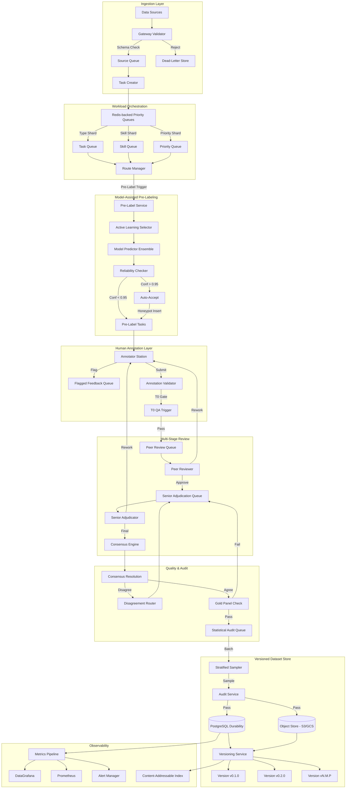
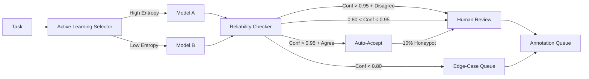
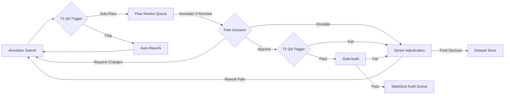
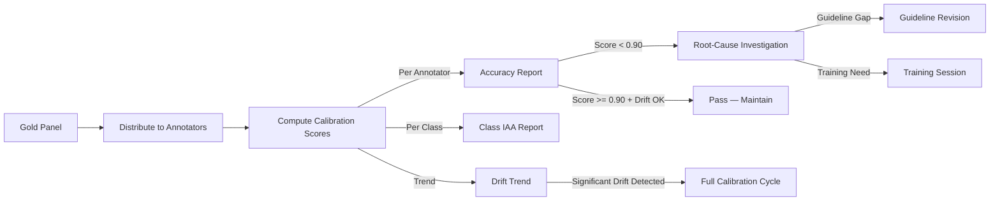

# Multi-Modal Annotation Quality & Pipeline Platform — Architecture

## 1. High-Level System Architecture



## 2. Ingestion and Task Creation Service

### Design Principles

The ingestion layer is a **schema-enforcing gateway** that validates, transforms, and
enriches raw data before it enters the annotation pipeline. Every datum is
validated against three contracts:

1. **Structural schema** — expected fields, types, cardinality, value ranges
2. **Modal integrity** — all required modalities present (e.g. image + LiDAR +
   radar for autonomous driving frames)
3. **Content integrity** — SHA-256 checksum verification, format magic-byte
   validation, corruption detection

### Data Model — Ingest Manifest

```json
{
  "manifest_id": "uuid-v7",
  "source": "camera-array-3",
  "ingested_at": "2026-07-15T10:30:00Z",
  "checksum_sha256": "a1b2c3...",
  "modalities": ["image", "lidar", "radar"],
  "task_type": "detection",
  "metadata": {
    "scene_id": "S-2026-07-15-001",
    "location": "intersection-23",
    "weather": "clear"
  },
  "schema_version": "2.1.0",
  "files": [
    {"path": "images/frame_001.jpg", "sha256": "...", "size": 234000},
    {"path": "lidar/frame_001.pcd", "sha256": "...", "size": 890000}
  ]
}
```

### Task Creation Algorithm

| Step | Component | Action |
|------|-----------|--------|
| 1 | Source Router | Classify data by `task_type` + `modality` tuple |
| 2 | Schema Enforcer | Validate against versioned task schema |
| 3 | Splitting | Partition into task units (1 frame = 1 task for detection; N frames = 1 task for tracking) |
| 4 | Enrichment | Attach gold panel samples for honeypot (P=0.05); attach instruction document hash |
| 5 | Pre-Label Router | Route to model-assisted pre-labeling service |
| 6 | Priority Assignment | Compute priority score = `urgency * (1 - domain_expert_availability) * batch_importance` |
| 7 | Queue Dispatch | Push to sharded Redis queue |

### Modality-Format Routing Table

| Task Type | Modalities | Pre-Labeler | Schema | Target Format |
|-----------|-----------|-------------|--------|---------------|
| object_detection | image | SAM 3 / YOLOv11 | COCO JSON | COCO, YOLO, VOC |
| instance_seg | image | SAM 3 | COCO JSON + RLE | COCO, Parquet |
| video_tracking | video | SAM 3 + ByteTrack | CVAT XML | CVAT, MOT |
| point_cloud | lidar | PointPillar | KITTI format | KITTI, NuScenes |
| text_class | text | BERT/DistilBERT | JSONL | JSONL, Parquet |
| multimodal_qa | text+image+audio | GPT-4o / Gemini | JSONL | JSONL |

## 3. Workload Queue Architecture

### Sharding Design

Queues are **triple-sharded** by:

```
Shard 1 — Task Type: detection | segmentation | tracking | classification
Shard 2 — Skill Level: novice | intermediate | expert | senior_reviewer
Shard 3 — Priority: P0 (critical) | P1 (high) | P2 (normal) | P3 (low)
```

Each shard maps to a dedicated Redis list. The Route Manager implements a
**weighted fair-queuing** algorithm:

```python
def assign_task(pipeline_config, annotator):
    eligible = []
    for queue in all_queues():
        if annotator.skill_level >= queue.min_skill \
           and annotator.modalities & queue.modalities:
            priority_weight = PRIORITY_WEIGHTS[queue.priority]
            load_score = redis.llen(queue.key) / annotator.capacity
            eligible.append((queue, priority_weight * (1 - load_score)))
    return max(eligible, key=lambda x: x[1])[0]
```

### Queue Metrics (exposed to Prometheus)

| Metric | Type | Labels | Description |
|--------|------|--------|-------------|
| `queue_depth` | Gauge | shard, priority | Current backlog |
| `queue_latency` | Histogram | shard | Time from enqueue to dequeue |
| `task_ttl` | Gauge | shard, priority | Estimated time to completion |
| `sla_breach_count` | Counter | shard, priority | Tasks exceeding SLA window |
| `worker_utilization` | Gauge | annotator_id | Fraction of capacity in use |

### Backpressure Mechanism

When any shard exceeds `max_depth_threshold`, the Route Manager signals the
Ingestion Gateway to reduce admission rate for that task type. When any shard
exceeds `critical_depth_threshold`, ingestion is paused and an alert fires.

## 4. Model-Assisted Pre-labeling Pipeline

### Architecture



### Active Learning Strategy

The selector implements **BALD (Bayesian Active Learning by Disagreement)** using
Monte Carlo Dropout with T=30 stochastic forward passes. Acquisition function:

```
a(x) = H[y|x, D_train] - E_{θ~p(θ|D_train)}[H[y|x, θ]]
```

Tasks with `a(x) > threshold_high` are routed for human-only annotation.
Tasks with `a(x) < threshold_low` receive auto-accepted pre-labels (subject to
10% honeypot insertion). All others receive model-assisted pre-labeling.

### Automation Bias Mitigation

Random 10% of auto-accepted tasks are injected into the human review queue as
unlabeled honeypots. If annotator agreement with auto-label drops below
`krippendorff_alpha < 0.80`, the auto-accept threshold is ratcheted up by 0.02
per failure event and a calibration alert is raised.

## 5. Human Annotation Interface Design

### Embedded Guidelines System

Guidelines are not linked documents. They are **versioned, schema-embedded
artifacts** with three delivery mechanisms:

1. **Contextual Tooltips** — When the annotator selects a label class, the
   interface displays the class's canonical definition + 3 positive examples +
   2 hard-negative examples, all from the gold panel.
2. **Interactive Decision Trees** — For ambiguous cases, a conditional decision
   tree guides the annotator through the taxonomy.
3. **Real-Time Validation** — Submission is blocked when:
   - Required fields are empty
   - Bounding box is zero-area or out-of-frame
   - Label falls outside allowed range per schema
   - Temporal tracks break continuity rules

### Keyboard Shortcut System

```
W — Next frame              A — Previous frame
S — Submit task             D — Skip / flag
Q — Zoom in                 E — Zoom out
1-9 — Label class hotkeys   Space — Toggle overlay
[ ] — Adjust brush size     Ctrl+Z — Undo
Ctrl+Shift+F — Flag for review
```

### Annotation Session Constraints

- Max session duration: 60 minutes (hard stop)
- Task switching recommended every 45 minutes
- Every 20th task is a gold panel honeypot (undisclosed)
- After 3 consecutive gold failures, session is paused with guideline refresher

## 6. Multi-Stage Review Workflow

### Stage Architecture



### Reviewer Assignment Algorithm

Peer reviewers are assigned by a **skill-weighted bipartite matching**:

```python
def assign_reviewer(annotation, pool):
    scores = {}
    for r in pool:
        if r.id == annotation.annotator_id:
            continue  # no self-review
        skill_match = jaccard(r.skill_tags & annotation.task_type.required_skills)
        history_score = 1 - (r.recent_rejection_rate(annotation.task_type) * 0.5)
        load_balance = 1 - (r.pending_reviews / r.max_reviews)
        scores[r.id] = skill_match * history_score * load_balance
    return max(scores, key=scores.get)
```

### Escalation Logic

Escalation to senior adjudication occurs when:
- Peer reviewer flags the task
- Annotator appeals the peer review
- Annotator's IAA rolling score drops below threshold for 3 consecutive batches
- Gold panel accuracy for this task type drops below 85% in the last 100 items
- Task type requires senior sign-off (configurable per project)

## 7. Consensus Engine Design

### IAA Metric Selection Matrix

| Scenario | Recommended Metric | Why |
|----------|-------------------|-----|
| 2 annotators, nominal | Cohen's κ | Corrects for chance, accounts for rater-specific biases |
| 3+ annotators, nominal, complete | Fleiss' κ | Generalizes Cohen to fixed multi-rater |
| 3+ annotators, missing data | Krippendorff's α | Handles missingness natively via coincidence matrix |
| Ordinal scale (Likert) | Krippendorff's α (ordinal) | Squared-rank distance function |
| Interval data | Krippendorff's α (interval) | Squared-difference distance function |
| 2 annotators, ordinal | Weighted Cohen's κ | Quadratic weights for ordinal closeness |
| Any scenario with imbalance | Gwet's AC1 | Resists kappa paradox in high-prevalence settings |

### Computation Pipeline

```python
class IAAComputation:
    def compute_all(self, annotations: pd.DataFrame) -> IAAReport:
        report = IAAReport()
        report.cohen_kappa = self._cohen_kappa(annotations)
        report.fleiss_kappa = self._fleiss_kappa(annotations)
        report.krippendorff_alpha = self._krippendorff_alpha(annotations)
        report.gwet_ac1 = self._gwet_ac1(annotations)
        report.observed_agreement = self._percent_agreement(annotations)
        report.confidence_intervals = self._bootstrap_ci(
            annotations, metrics=["cohen", "fleiss", "krippendorff"], n_iterations=5000
        )
        report.per_class_iaa = self._per_class_breakdown(annotations)
        report.confusion_matrix = self._confusion_matrix(annotations)
        return report

    def _bootstrap_ci(self, annotations, metrics, n_iterations):
        results = {m: [] for m in metrics}
        n = len(annotations)
        rng = np.random.default_rng(seed=7777)
        for _ in range(n_iterations):
            sample = annotations.sample(n=n, replace=True, random_state=rng)
            for m in metrics:
                results[m].append(self._compute_metric(m, sample))
        return {
            m: {
                "ci_95_lower": np.percentile(vals, 2.5),
                "ci_95_upper": np.percentile(vals, 97.5),
                "ci_90_lower": np.percentile(vals, 5.0),
                "ci_90_upper": np.percentile(vals, 95.0),
                "std_err": np.std(vals),
            }
            for m, vals in results.items()
        }
```

### IAA Acceptance Gates

| Gate | Metric | Threshold | Action |
|------|--------|-----------|--------|
| Per-batch | Krippendorff's α | ≥ 0.80 | Pass — firm conclusions |
| Per-batch | Krippendorff's α | 0.667–0.80 | Conditional pass — flag for review |
| Per-batch | Krippendorff's α | < 0.667 | Batch rework + spec review |
| Per-class | Cohen's κ (pairwise) | ≥ 0.75 | Pass |
| Per-class | Cohen's κ (pairwise) | < 0.75 | Spec ambiguity investigation |
| Rolling 7-day | Krippendorff's α | < 0.75 | Full calibration cycle |

### Disagreement Routing

When consensus fails (IAA below gate), the Disagreement Router:

1. **Clusters disagreement patterns** — Uses hierarchical clustering on
   confusion matrices to identify natural disagreement clusters.
2. **Diagnoses root causes** — Disagreement clusters are categorized:
   - *Spec ambiguity* — Labels overlap in taxonomy (top cluster)
   - *Edge case* — Rare or novel instance types
   - *Systematic bias* — One annotator consistently diverges
3. **Routes to resolution**:
   - Spec ambiguity → Guideline Revision Workflow
   - Edge case → Senior Adjudication Queue (with original annotations)
   - Systematic bias → Annotator retraining or calibration

## 8. Gold Panel Management

### Panel Creation

Gold panels are curated from entirely adjudicated (3+ passes) items with
definitive ground truth. Creation follows a **stratified sampling** process:

```python
def create_gold_panel(pool, target_size=1000):
    strata = {
        "easy":   {"difficulty": 0.0, "fraction": 0.3},
        "medium": {"difficulty": 0.3, "fraction": 0.4},
        "hard":   {"difficulty": 0.6, "fraction": 0.2},
        "expert": {"difficulty": 0.8, "fraction": 0.1},
    }
    panel = {}
    for name, cfg in strata.items():
        candidates = pool[pool.difficulty_score.between(
            cfg["difficulty"], cfg["difficulty"] + 0.3
        )]
        n = int(target_size * cfg["fraction"])
        panel[name] = candidates.sample(n=n, random_state=42, replace=False)
    return pd.concat(panel)
```

### Stratification Dimensions

Gold panel items are stratified across:
1. **Class/difficulty** — Proportional to task taxonomy complexity
2. **Modality** — Representative of the production mix
3. **Data source** — Each source contributes proportionally
4. **Edge case density** — Deliberate over-sampling of ambiguous cases

### Rotation Cadence

| Operation | Frequency | Action |
|-----------|-----------|--------|
| Refresh | Every 4 weeks | 20% of panel rotated out, replaced with newly adjudicated items |
| Re-calibration | Every 2 weeks | Gold panel re-run against all annotators; drift detection |
| Full rebuild | Every 12 weeks | Entire panel reconstructed from latest adjudicated pool |
| Ad-hoc insert | On high-disagreement | Hard cases from disagreement clusters added immediately |

### Calibration Pipeline



## 9. Statistical Audit System

### Sampling Design

Batches are audited using **stratified random sampling** with optimal allocation:

```
n_h = (N_h * σ_h) / Σ(N_h * σ_h) * n
```

Where:
- `n_h` = sample size from stratum h
- `N_h` = population size of stratum h
- `σ_h` = estimated error rate in stratum h
- `n` = total sample size determined by desired precision

### Sample Size Determination

For error rate estimation with confidence level `1-α` and margin of error `d`:

```
n = (Z² * p * (1-p)) / d²
```

Where:
- `Z` = z-score for desired confidence (1.96 for 95%)
- `p` = expected error rate (conservatively 0.10 for unknown)
- `d` = desired margin of error (0.02 for high-stakes, 0.05 for standard)

### Acceptance Sampling (Alternative)

When the goal is accept/reject rather than precise estimation, we use
**double acceptance sampling** with curtailment:

```
Plan: n1 = 50, accept on ≤ 1 error, reject on ≥ 4 errors
      n2 = 50 (if 2-3 errors on n1), accept on ≤ 3 total errors
```

This reduces required sample size by up to 50% vs. confidence interval
estimation while providing equivalent statistical guarantees.

### Audit Report Schema

```json
{
  "audit_id": "uuid-v7",
  "batch_id": "batch-2026-07-15-001",
  "batch_size": 5000,
  "sample_size": 250,
  "sample_strategy": "stratified",
  "strata": [
    {"label": "easy", "n": 75, "errors": 2, "error_rate": 0.027},
    {"label": "medium", "n": 100, "errors": 5, "error_rate": 0.050},
    {"label": "hard", "n": 75, "errors": 8, "error_rate": 0.107}
  ],
  "overall_error_rate": 0.060,
  "ci_95": [0.033, 0.095],
  "acceptance_decision": "conditional_pass",
  "audited_at": "2026-07-16T14:00:00Z",
  "auditor_id": "senior-42",
  "escalated_items": ["task-uuid-1", "task-uuid-2"]
}
```

## 10. Versioned Dataset Store

### Content-Addressed Architecture

Labels and raw data are stored separately with **content-addressable pointers**:

```
Raw Data (immutable content-addressable):
  /data/{modality}/{sha256[:3]}/{sha256}.{ext}

Labels (versioned label groups per schema):
  /labels/{schema_version}/{image_sha256}/{label_group_hash}.parquet

Snapshots (immutable manifests):
  /snapshots/{dataset_name}/{semver}.snapshot.json
```

### Snapshot Manifest Schema

```json
{
  "dataset": "production-v4",
  "version": "4.2.1",
  "created_at": "2026-07-16T10:00:00Z",
  "parent_version": "4.2.0",
  "schema_version": "2.1.0",
  "content_hash": "sha256:abc123...",
  "stats": {
    "total_images": 150000,
    "total_annotations": 890000,
    "classes": 45,
    "batch_ids": ["batch-001", "batch-002"],
    "train_split": 0.80,
    "val_split": 0.10,
    "test_split": 0.10
  },
  "qa_summary": {
    "gold_accuracy": 0.965,
    "krippendorff_alpha": 0.842,
    "audit_pass_rate": 0.94,
    "flattened_error_rate": 0.031
  },
  "provenance": {
    "source_ingest_range": ["2026-06-01", "2026-07-15"],
    "annotator_pool_size": 24,
    "reviewers_active": 8,
    "adjudications": 312
  },
  "lineage": {
    "parent": "4.2.0",
    "merges": ["hotfix-4.2.1a"],
    "triggers": [
      {"type": "scheduled", "date": "2026-07-16"},
      {"type": "gold_drift", "threshold": 0.02}
    ]
  }
}
```

### Provenance Chain

Every annotation is traceable through a full provenance DAG:

```
Production Prediction
  └─ Model Checkpoint v7.3.1
       └─ Dataset Snapshot v4.2.1
            └─ Annotation group {hash}
                 ├─ Annotator: user-42
                 ├─ Reviewer: user-17
                 ├─ Adjudicator: user-3 (if escalated)
                 ├─ Guideline version: 2.1.0
                 └─ Gold panel hit: false
```

### Storage Format Selection

| Format | Use Case | Compression | Query Pattern |
|--------|----------|-------------|---------------|
| Parquet + Zstd | Structured annotations | 8-12x | Analytical queries, column projection |
| JSON Lines | Streaming export | 3-5x | Line-by-line processing |
| COCO JSON | CV standard release | 2-3x | Ecosystem compatibility |
| YOLO .txt | Ultra-fast training ingest | 1x (raw) | Per-image label load |
| Pascal VOC XML | Legacy compatibility | 2x | XML parsing |

## 11. Monitoring Dashboards

### Dashboard Taxonomy

| Dashboard | Audience | Refresh | Key Panels |
|-----------|----------|---------|------------|
| Operations | Pipeline managers | Real-time | Queue depth, throughput, latency, SLA attainment |
| Quality | QA leads | 15 min | Gold accuracy (with CI), IAA per class, audit pass rate |
| Annotator | Project managers | Daily | Per-annotator speed, accuracy trend, rework rate |
| Consensus | Spec owners | Weekly | Krippendorff's α trend, disagreement clusters, spec revision count |
| Executive | Stakeholders | Monthly | Dataset version history, quality-cost curve, release readiness |

### Prometheus Instrumentation Points

```
annotation_request_latency_ms{stage="ingestion",format="coco"}
annotation_request_latency_ms{stage="prelabel",model="yolo11"}
prelabel_confidence_histogram{model="sam3"}
queue_depth{shard="detection",priority="p0"}
iaa_krippendorff_alpha{task_type="detection",window="7d"}
gold_panel_accuracy{stratum="hard"}
audit_error_rate{batch_id="batch-001"}
dataset_version_count{dataset="production-v4"}
```

### SLA Framework

| Metric | Target | Warning | Critical |
|--------|--------|---------|----------|
| P0 queue latency | < 1 hour | > 2 hours | > 4 hours |
| Gold panel accuracy | ≥ 0.95 | < 0.92 | < 0.90 |
| IAA (Krippendorff's α) | ≥ 0.80 | < 0.75 | < 0.667 |
| Audit pass rate | ≥ 0.95 | < 0.90 | < 0.85 |
| Dataset release cycle | ≤ 7 days | > 10 days | > 14 days |
| Annotator satisfaction | ≥ 4.0/5 | < 3.5/5 | < 3.0/5 |
| P95 annotation latency | ≤ 30 min/task | > 45 min | > 60 min |
