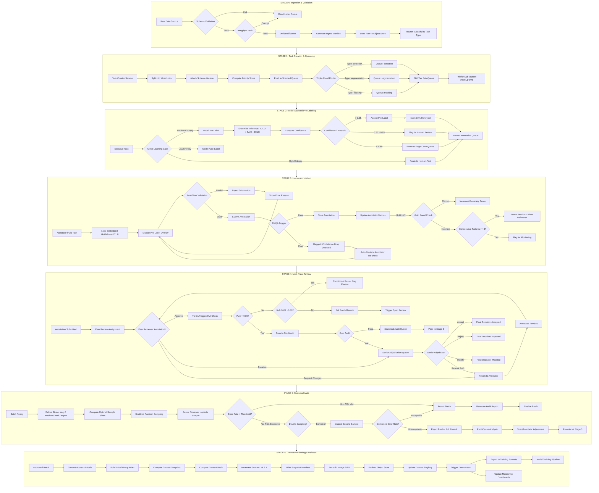
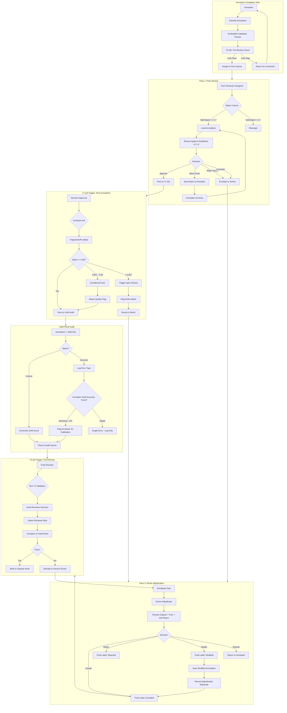
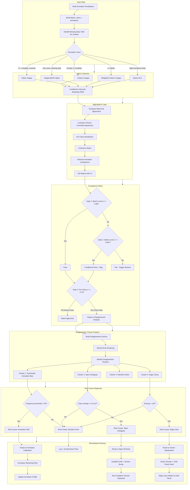
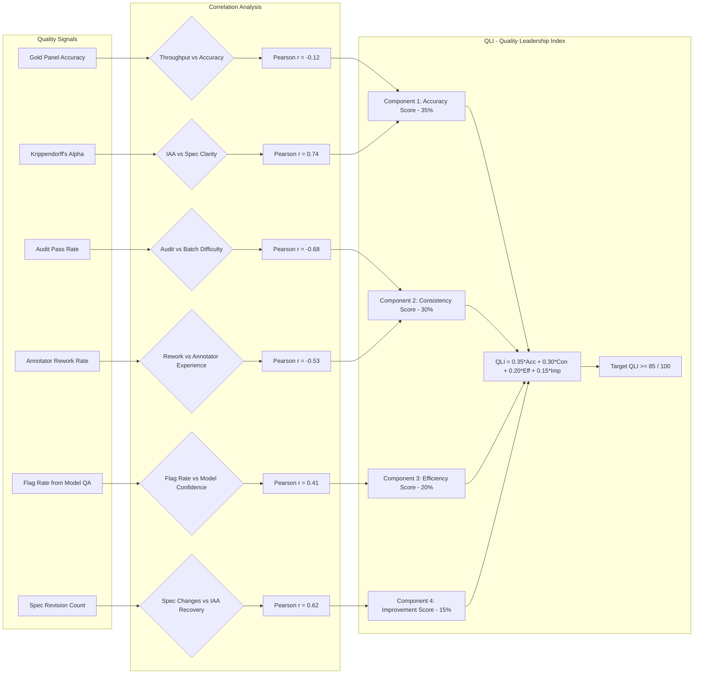

# Multi-Modal Annotation Quality & Pipeline Platform — Flows

## 1. End-to-End Annotation Lifecycle



## 2. Multi-Pass Review Workflow



## 3. IAA Computation and Disagreement Routing Flow



## 4. Gold Panel Calibration and Rotation Lifecycle

```mermaid
flowchart TB
    subgraph CREATE["Gold Panel Creation"]
        A[Adjudicated Annotation Pool] --> A1[Stratify by Difficulty]
        A1 --> A2[Stratify by Class]
        A2 --> A3[Stratify by Modality]
        A3 --> A4[Stratify by Data Source]
        A4 --> A5[Sample: 300 easy / 400 medium / 200 hard / 100 expert]
        A5 --> A6[3+ Independent Adjudications Required]
        A6 --> A7[Compute Gold Ground Truth]
        A7 --> A8[Assign Panel IDs]
        A8 --> A9[Register in Gold Panel Table]
    end

    subgraph ACTIVE["Active Use Phase"]
        B[Gold Panel Active] --> B1[Honeypot Injection: P=0.05 per task]
        B1 --> B2[Annotator Labels Task]
        B2 --> B3{Is Gold Hit?}
        B3 -->|Yes| B4[Compare to Gold Standard]
        B3 -->|No| B5[Normal Processing]
        B4 --> B6[Record Result: Correct / Incorrect]
        B6 --> B7[Update Rolling Annotator Accuracy]
        B7 --> B8{Accuracy < Threshold?}
        B8 -->|No| B1
        B8 -->|Yes| B9[Flag Annotator]
        B9 --> B10[Suspend or Retrain]
    end

    subgraph RECALIB["Recalibration Cycle: Every 2 Weeks"]
        C[Recalibration Trigger] --> C1[Run Gold Panel Against All Active Annotators]
        C1 --> C2[Compute Per-Annotator Accuracy]
        C2 --> C3[Compute Per-Class Accuracy]
        C3 --> C4[Compute Per-Stratum Accuracy]
        C4 --> C5[Drift Detection vs Previous]
        C5 --> C6{Global Accuracy Change > 2%?}
        C6 -->|Yes| C7[Alert: Systematic Drift]
        C6 -->|No| C8{Per-Stratum Change > 5%?}
        C8 -->|Yes| C9[Alert: Stratum-Specific Drift]
        C8 -->|No| C10[No Significant Drift]
        C7 --> C11[Root-Cause Investigation]
        C9 --> C11
        C11 --> C12[Guideline Revision / Retraining]
        C12 --> C13[Update Calibration Records]
    end

    subgraph ROTATE["Rotation: Every 4 Weeks"]
        D[Rotation Trigger] --> D1[Identify 20% of Panel for Retirement]
        D1 --> D2[Select New Adjudicated Items]
        D2 --> D3[Require 3+ Adjudications]
        D3 --> D4[Replace Retired Items]
        D4 --> D5[Update Stratum Balance]
        D5 --> D6[Increment Rotation Round]
        D6 --> D7[Panels older than 12 weeks: Archive]
    end

    subgraph REBUILD["Full Rebuild: Every 12 Weeks"]
        E[Full Rebuild Trigger] --> E1[Archive Entire Gold Panel]
        E1 --> E2[Select Fresh Pool from Latest Adjudicated]
        E2 --> E3[Re-run Stratified Sampling]
        E3 --> E4[Require Fresh 3+ Adjudications]
        E4 --> E5[Build New Panel]
        E5 --> E6[Baseline All Annotators Against New Panel]
        E6 --> E7[Set Rotation Round to 0]
    end

    subgraph ADHOC["Ad-Hoc Insertion"]
        F[Edge Case Identified] --> F1[Senior Adjudicator Reviews]
        F1 --> F2[Adjudicate to Gold Standard]
        F2 --> F3[Assign Difficulty Score]
        F3 --> F4[Insert Into Gold Panel]
        F4 --> F5[Increment Active Count]
        F5 --> F6{Size Exceeds Max?}
        F6 -->|Yes| F7[Retire Lowest-Value Item]
        F6 -->|No| F8[Continue]
    end

    CREATE --> ACTIVE
    ACTIVE --> RECALIB
    ACTIVE --> ROTATE
    ACTIVE --> REBUILD
    ACTIVE --> ADHOC
    RECALIB --> ACTIVE
    ROTATE --> ACTIVE
```



## 5. Statistical Audit Sampling Flow

```mermaid
flowchart TB
    subgraph BATCH["Batch Submitted for Audit"]
        A[Batch: 5000 Annotations] --> A1[Define Strata]
        A1 --> A2[Stratum 1: Easy - n=3000, expected error=2%]
        A2 --> A3[Stratum 2: Medium - n=1500, expected error=5%]
        A3 --> A4[Stratum 3: Hard - n=500, expected error=12%]
    end

    subgraph SAMPLE["Sample Size Computation"]
        A4 --> B1{Estimation or Acceptance?}
        B1 -->|Error Rate Estimation| B2[CI Method]
        B1 -->|Accept/Reject Decision| B3[Acceptance Sampling]
        B2 --> B4[Input: 95% confidence, d=0.02 margin]
        B4 --> B5[Compute: n = Z² * p * (1-p) / d²]
        B5 --> B6[n_easy=235, n_medium=456, n_hard=295]
        B6 --> B7[Total Sample: 986]
        B3 --> B8[Input: AQL=2%, RQL=8%, α=0.05, β=0.10]
        B8 --> B9[Double Sampling Plan: n1=50, n2=80]
        B9 --> B10[Plan: Accept on ≤1 error (n1), ≤3 (n1+n2)]
    end

    subgraph EXECUTE["Sample Execution"]
        B7 --> C1[Stratified Random Draw]
        C1 --> C2[Extract 986 Annotations]
        C2 --> C3[Assign to Senior Auditors]
        C3 --> C4[Auditor Inspects Each Sample]
        C4 --> C5[Record: Correct / Error Type]
    end

    subgraph EVALUATE["Evaluation"]
        C5 --> D1[Compute Strata Error Rates]
        D1 --> D2[e_easy=1.8%, e_medium=4.2%, e_hard=9.5%]
        D2 --> D3[Compute Overall: e=3.1%]
        D3 --> D4[Compute 95% CI: [2.1%, 4.5%]]
        D4 --> D5{Upper CI < AQL?}
        D5 -->|Yes| D6[Accept Batch]
        D5 -->|No| D7{Lower CI > RQL?}
        D7 -->|Yes| D8[Reject Batch]
        D7 -->|No| D9[Conditional - Expand Sample]
        D9 --> D10[Double Sample]
        D10 --> D11[Re-evaluate Combined]
        D11 --> D12{Acceptable?}
        D12 -->|Yes| D6
        D12 -->|No| D8
    end

    subgraph POST["Post-Audit Actions"]
        D6 --> E1[Batch Approved]
        E1 --> E2[Update Batch Status: audited]
        E2 --> E3[Route to Dataset Store]
        D8 --> E4[Batch Rejected]
        E4 --> E5[Flag All Tasks for Rework]
        E5 --> E6[Root-Cause Analysis]
        E6 --> E7[Tag Error Types]
        E7 --> E8[Systematic?]
        E8 -->|Yes| E9[Adjust Spec or Retrain]
        E8 -->|No| E10[Return to Annotator Pool]
        E9 --> E11[Update Calibration Records]
        E10 --> E12[Reset Batch Status: pending]
    end

    BATCH --> SAMPLE
    SAMPLE --> EXECUTE
    EXECUTE --> EVALUATE
    EVALUATE --> POST
```

## 6. Model-Assisted QA Flagging Flow

```mermaid
flowchart TB
    subgraph TRIGGER["Flagging Triggers"]
        A[Annotation Submitted] --> A1{Check Triggers}
        A1 --> B1[Trigger 1: ML Confidence Gap]
        A1 --> B2[Trigger 2: Temporal Inconsistency]
        A1 --> B3[Trigger 3: Object Coverage Alert]
        A1 --> B4[Trigger 4: Class Distribution Anomaly]
        A1 --> B5[Trigger 5: Geometry Violation]
        A1 --> B6[Trigger 6: Annotator Behavioral Signal]
    end

    subgraph LOGIC["Trigger Logic"]
        B1 --> C1[|human_conf - model_conf| > 0.3?]
        C1 -->|Yes| C2[Flag: Confidence Gap]
        B2 --> C3[Same track, prev frame: car, current: truck?]
        C3 -->|Yes| C4[Flag: Track ID Jump]
        B3 --> C5[Model detects N objects, human labels N-2?]
        C5 -->|Yes| C6[Flag: Missing Object]
        B4 --> C7[Class proportion > 3σ from batch mean?]
        C7 -->|Yes| C8[Flag: Distribution Anomaly]
        B5 --> C9[bbox outside frame or zero area?]
        C9 -->|Yes| C10[Flag: Invalid Geometry]
        B6 --> C11[Annotator avg time 8s, this task 45s?]
        C11 -->|Yes| C12[Flag: Behavioral Anomaly]
    end

    subgraph SEVERITY["Severity Scoring"]
        C2 --> D1[Severity = 0.8]
        C4 --> D2[Severity = 0.9]
        C6 --> D3[Severity = 0.6]
        C8 --> D4[Severity = 0.4]
        C10 --> D5[Severity = 1.0]
        C12 --> D6[Severity = 0.3]
        D1 --> D7[Compute Composite Score]
        D2 --> D7
        D3 --> D7
        D4 --> D7
        D5 --> D7
        D6 --> D7
        D7 --> D8{Composite Score Threshold}
    end

    subgraph ACTION["Action Routing"]
        D8 -->|>= 0.9| E1[Immediate Escalation to Senior]
        D8 -->|0.6 - 0.9| E2[Return to Annotator with Flag]
        D8 -->|0.3 - 0.6| E3[Attach Warning to Task]
        D8 -->|< 0.3| E4[Log Only - No Action]
        E1 --> E5[Senior Reviews Full Context]
        E5 --> E6{Confirmed Error?}
        E6 -->|Yes| E7[Correct + Log Error Pattern]
        E6 -->|No| E8[Dismiss Flag - Update Model]
        E2 --> E9[Annotator Reviews Flag]
        E9 --> E10{Annotator Agrees?}
        E10 -->|Yes| E11[Annotator Corrects]
        E10 -->|No| E12[Annotator Disputes]
        E12 --> E13[Auto-Escalate to Senior]
        E3 --> E14[QA Reviewer Sees Warning]
        E14 --> E15[Spot-Check During Review]
    end

    subgraph FEEDBACK["Feedback Loop"]
        E8 --> F1[Update ML Confidence Calibration]
        E7 --> F2[Add Error Case to Training Set]
        F2 --> F3[Periodic Model Retraining Trigger]
        E11 --> F4[Update Annotator Flag Profile]
        F4 --> F5[Flag Rate Threshold Monitoring]
        F5 --> F6{Per-Annotator Flag Rate > 2σ?}
        F6 -->|Yes| F7[Investigate Annotator or Guidelines]
        F6 -->|No| F8[Continue Normal Operations]
    end

    TRIGGER --> LOGIC
    LOGIC --> SEVERITY
    SEVERITY --> ACTION
    ACTION --> FEEDBACK
```

## 7. Dataset Versioning and Release Pipeline

```mermaid
flowchart TB
    subgraph INPUT["Approved Annotations Arrive"]
        A[Batch Approved by Audit] --> A1[Collect Label Groups]
        A1 --> A2[Verify Content Hashes Match]
        A2 -->|Mismatch| A3[Reject Batch - Integrity Error]
        A2 -->|Match| A4[Proceed to Versioning]
    end

    subgraph BUILD["Snapshot Build"]
        A4 --> B1[Load Previous Snapshot Manifest]
        B1 --> B2[Difference Computation]
        B2 --> B3[New Labels: +12,450]
        B3 --> B4[Modified Labels: +230]
        B4 --> B5[Compute New Content Hash]
        B5 --> B6{Bump Type}
        B6 -->|Schema Changed| B7[Major Bump: v4.0.0 -> v5.0.0]
        B6 -->|Labels Changed| B8[Minor Bump: v4.2.0 -> v4.3.0]
        B6 -->|Metadata Only| B9[Patch Bump: v4.2.1 -> v4.2.2]
        B7 --> B10[Generate Semver]
        B8 --> B10
        B9 --> B10
    end

    subgraph MANIFEST["Manifest Generation"]
        B10 --> C1[Write Snapshot Manifest JSON]
        C1 --> C2[Embed: dataset_name, semver, parent]
        C2 --> C3[Embed: schema_version, content_hash]
        C3 --> C4[Embed: stats - counts, splits, classes]
        C4 --> C5[Embed: qa_summary - gold, iaa, audit]
        C5 --> C6[Embed: provenance - lineage DAG]
        C6 --> C7[Embed: batch references]
        C7 --> C8[Sign Manifest with HMAC-SHA256]
    end

    subgraph STORE["Storage & Index"]
        C8 --> D1[Upload Manifest to Object Store]
        D1 --> D2[/snapshots/production-v4/v4.3.0.snapshot.json]
        D2 --> D3[Write Parquet Index]
        D3 --> D4[/snapshots/production-v4/v4.3.0.index.parquet]
        D4 --> D5[Update PostgreSQL Registry]
        D5 --> D6[INSERT INTO dataset_versions]
    end

    subgraph VERIFY["Verification"]
        D6 --> E1[Verify Content Hash]
        E1 --> E2[Recompute Tree Hash]
        E2 --> E3{Matches Manifest?}
        E3 -->|Yes| E4[Verification Passed]
        E3 -->|No| E5[Integrity Failure - Alert]
        E5 --> E6[Rollback Version Record]
        E6 --> E7[Investigate Storage Corruption]
    end

    subgraph EXPORT["Multi-Format Export"]
        E4 --> F1[Trigger Export Pipeline]
        F1 --> F2[Format: COCO JSON]
        F2 --> F3[Export: train/val/test splits]
        F1 --> F4[Format: YOLO .txt]
        F4 --> F5[Export: per-image label files]
        F1 --> F6[Format: Parquet]
        F6 --> F7[Export: columnar + metadata]
        F1 --> F8[Format: JSONL]
        F8 --> F9[Export: line-delimited]
        F1 --> F10[Format: Pascal VOC XML]
        F10 --> F11[Export: per-image XML]
        F3 --> F12[Upload Exports to Object Store]
        F5 --> F12
        F7 --> F12
        F9 --> F12
        F11 --> F12
    end

    subgraph RELEASE["Release & Notify"]
        F12 --> G1[Update Latest Version Pointer]
        G1 --> G2[Tag in Registry: production-v4@latest = v4.3.0]
        G2 --> G3[Push Event: dataset.released]
        G3 --> G4[Notify Downstream Pipelines]
        G4 --> G5[Webhook: Model Training Trigger]
        G4 --> G6[Webhook: Monitoring Dashboard]
        G4 --> G7[Webhook: Data Science Team]
        G5 --> G8[Training Pipeline Pulls New Version]
        G6 --> G9[Dashboard Updates: v4.3.0 Stats]
        G7 --> G10[Release Notes Sent]
    end

    subgraph LINEAGE["Lineage & Audit"]
        G10 --> H1[Record Full Lineage Chain]
        H1 --> H2[Source Data: S3://raw/{sha256}/...]
        H2 --> H3[Annotations: PostgreSQL annotation IDs]
        H3 --> H4[Reviewers: PostgreSQL reviewer IDs]
        H4 --> H5[Adjudications: PostgreSQL adjudication IDs]
        H5 --> H6[Audits: PostgreSQL audit IDs]
        H6 --> H7[Version: PostgreSQL version record]
        H7 --> H8[Training Runs: External MLflow Registry]
        H8 --> H9[Production Models: External Model Registry]
        H9 --> H10[Predictions: External Prediction Store]
    end

    INPUT --> BUILD
    BUILD --> MANIFEST
    MANIFEST --> STORE
    STORE --> VERIFY
    VERIFY --> EXPORT
    EXPORT --> RELEASE
    RELEASE --> LINEAGE
```

## Aggregate Quality Signal Correlation


